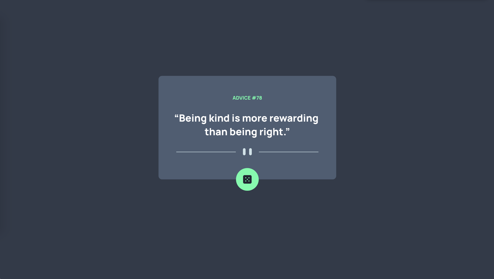
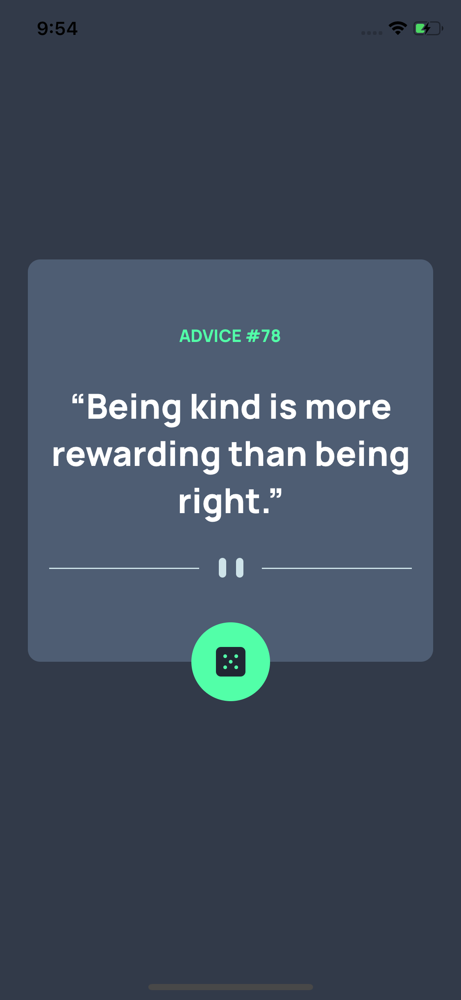

# Advice Generator - React Native for Web

## Screenshots

  <h3>Web</h3>
  

 

  <h3>Mobile - iOS</h3>
  
  

 

## Built with

- [Expo Cli](https://github.com/expo/expo-cli)
- [React Native for Web](https://github.com/necolas/react-native-web)

- [React Native SVG Transformer](https://github.com/kristerkari/react-native-svg-transformer) - For transforming SVG files to use in React Native
- [React Native SVG](https://github.com/react-native-svg/react-native-svg) - For including the transformed SVG in React Native
- [Advice Slip API](https://api.adviceslip.com)
- [Frontend Mentor - Advice Generator App Challenge](https://github.com/frontendmentorio/advice-generator-app) - App idea, design, dice-icon, dividers
- [hand-holding-heart](https://github.com/FortAwesome/Font-Awesome/blob/6.x/svgs/solid/hand-holding-heart.svg) by [FontAwesome](https://github.com/FortAwesome/Font-Awesome) licensed under [CC BY 4.0](https://creativecommons.org/licenses/by/4.0/) - Favicon